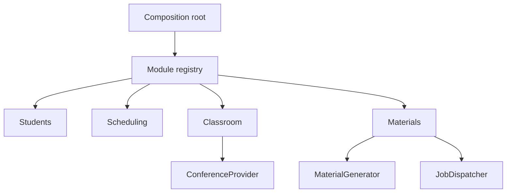
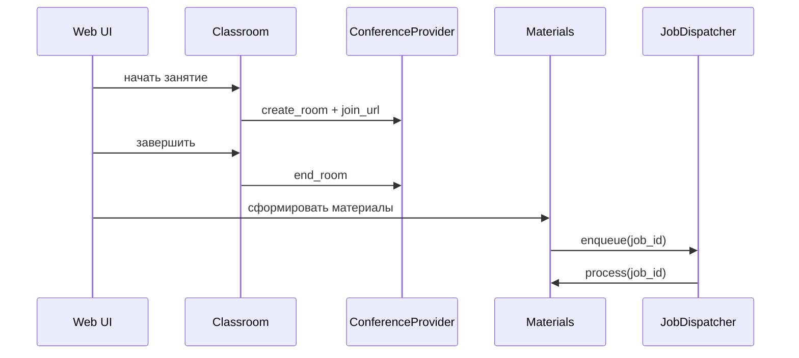
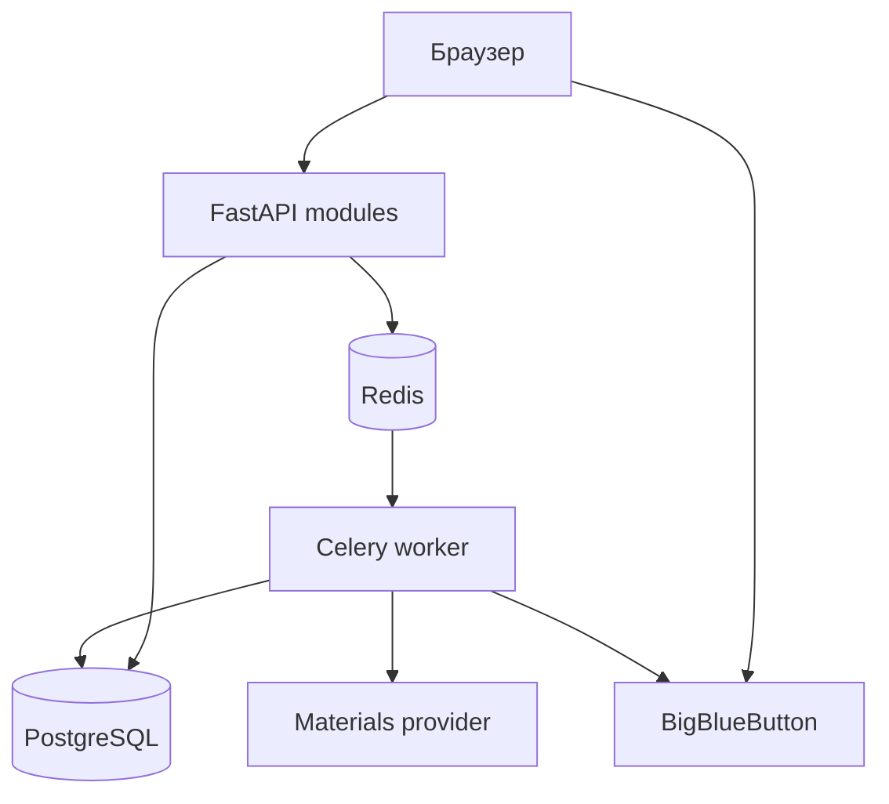

# Архитектура модульного пилота

## Принцип

Приложение развивается как модульный монолит. FastAPI, PostgreSQL и один deployment сохраняются,
а бизнес-функции имеют явные границы. Внешние системы подключаются через provider-контракты.

## Модули

| Модуль | Ответственность | Зависимости |
|---|---|---|
| `identity` | общий доступ, сессии, CSRF | — |
| `students` | профиль и контакты ученика | identity |
| `scheduling` | недельная сетка и конфликты | students |
| `classroom` | комната, роли, записи, заметки | scheduling |
| `materials` | evidence, jobs и артефакты | classroom |
| `dashboard` | сводка и диагностика | materials |

`ModuleRegistry` проверяет уникальность имён, отсутствующие зависимости и циклы. Выбор корневых
модулей задаётся `ENABLED_MODULES`; транзитивные зависимости устанавливаются автоматически.

## Provider-контракты

- `ConferenceProvider`: `demo` или `bigbluebutton`;
- `MaterialGenerator`: локальный шаблон или HTTP webhook;
- `JobDispatcher`: inline для разработки или Celery для production.

Application-слой зависит от протоколов из `shared/contracts.py`. Конкретные SDK и HTTP-клиенты
остаются в `providers/`. Замена BBB или генератора не требует правок бизнес-модулей.

## Поток занятия

## Правила зависимостей

1. HTTP routes вызывают application-сервисы.
2. Routes не импортируют SQLAlchemy и BigBlueButton adapter.
3. Бизнес-модели размещаются в модуле-владельце.
4. Провайдеры реализуют общие Protocol-контракты.
5. `app.py` содержит только создание приложения и команду запуска.
6. Старые `models.py` и `services.py` служат временным compatibility facade.

Эти правила проверяются в `tests/test_architecture.py`.

## Контейнеры

BigBlueButton работает отдельно. Shared secret остаётся на backend.

## Следующие архитектурные задачи

1. Alembic и миграции, принадлежащие модулям.
2. Identity с пользователями, ролями и tenant isolation.
3. Transactional outbox и доменные события.
4. Recording-ready webhook и идемпотентные workflow.
5. Версионированный `LessonEvidenceBundle`.

