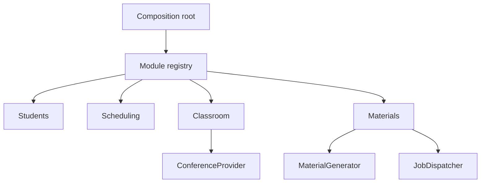
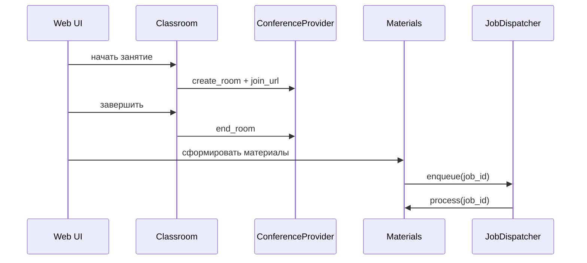
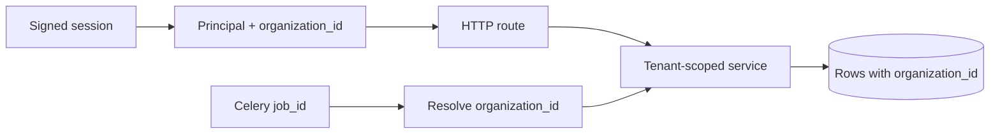
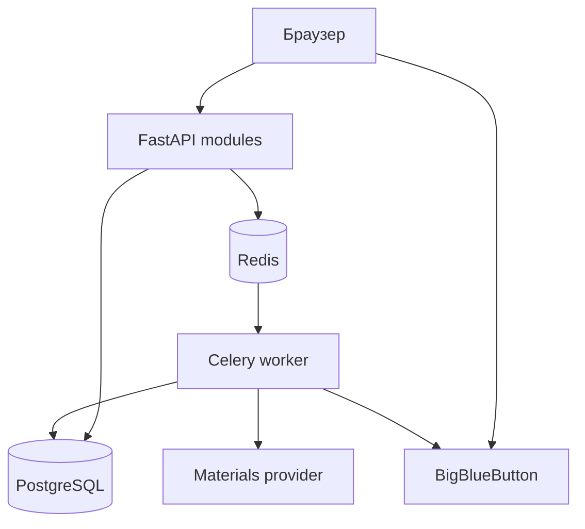

# Архитектура модульного пилота

## Принцип

Приложение развивается как модульный монолит. FastAPI, PostgreSQL и один deployment сохраняются,
а бизнес-функции имеют явные границы. Внешние системы подключаются через provider-контракты.

## Модули

| Модуль | Ответственность | Зависимости |
|---|---|---|
| `identity` | организации, пользователи, роли, сессии, CSRF | — |
| `students` | профиль и контакты ученика | identity |
| `scheduling` | недельная сетка и конфликты | students |
| `classroom` | комната, роли, записи, заметки | scheduling |
| `materials` | evidence, jobs и артефакты | classroom |
| `dashboard` | сводка и диагностика | materials |

`ModuleRegistry` проверяет уникальность имён, отсутствующие зависимости и циклы. Выбор корневых
модулей задаётся `ENABLED_MODULES`; транзитивные зависимости устанавливаются автоматически.

## Provider-контракты

- `ConferenceProvider`: `demo` или `bigbluebutton`;
- `MaterialGenerator`: локальный шаблон или HTTP webhook;
- `JobDispatcher`: inline для разработки или Celery для production.

Application-слой зависит от протоколов из `shared/contracts.py`. Конкретные SDK и HTTP-клиенты
остаются в `providers/`. Замена BBB или генератора не требует правок бизнес-модулей.

## Поток занятия

## Правила зависимостей

1. HTTP routes вызывают application-сервисы.
2. Routes не импортируют SQLAlchemy и BigBlueButton adapter.
3. Бизнес-модели размещаются в модуле-владельце.
4. Провайдеры реализуют общие Protocol-контракты.
5. `app.py` содержит только создание приложения и команду запуска.
6. Старые `models.py` и `services.py` служат временным compatibility facade.

Эти правила проверяются в `tests/test_architecture.py`.

## Граница организации

После успешного входа подписанная сессия содержит `user_id`, `organization_id` и роль membership.
Каждый HTTP route создаёт application-сервис в scope текущей организации. Запросы учеников,
занятий, записей, фоновых заданий и материалов всегда содержат фильтр `organization_id`.

Публичная ссылка ученика остаётся вне пользовательской сессии. HMAC привязывает её к конкретным
`lesson_id` и `student_id`; поиск выполняется только для этой пары. Роли `admin` и `tutor` имеют
доступ к административным маршрутам. Роли `student` и `parent` зарезервированы для кабинетов.

## Миграции

Alembic является владельцем схемы. Ревизия `0001_pilot` описывает схему версии 0.2,
`0002_identity_tenancy` добавляет identity и tenant-ключи. При первом запуске версии 0.3 база,
ранее созданная через `create_all`, автоматически получает stamp `0001_pilot`; все существующие
строки переносятся в организацию по умолчанию. Новая база проходит обе ревизии с нуля.

## Контейнеры

BigBlueButton работает отдельно. Shared secret остаётся на backend.

## Следующие архитектурные задачи

1. Управление пользователями, приглашения и переключение организации.
2. Transactional outbox и доменные события.
3. Recording-ready webhook и идемпотентные workflow.
4. Версионированный `LessonEvidenceBundle`.
5. Audit log и политика retention.
