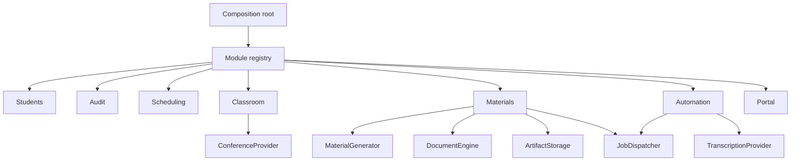
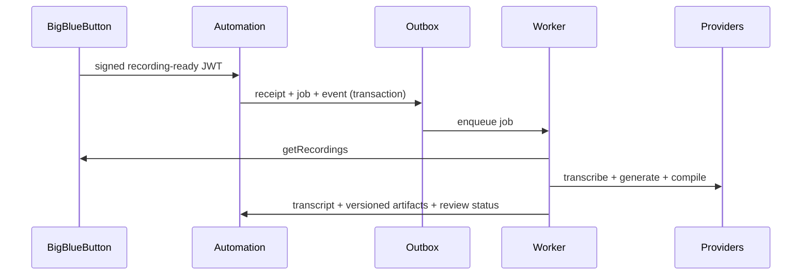
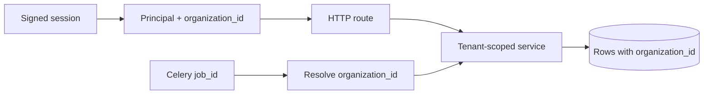
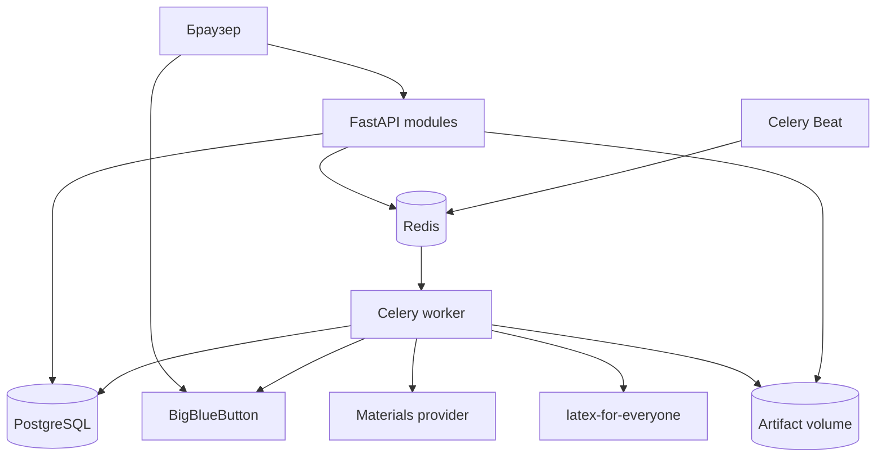

# Архитектура модульного пилота

## Принцип

Приложение развивается как модульный монолит. FastAPI, PostgreSQL и один deployment сохраняются,
а бизнес-функции имеют явные границы. Внешние системы подключаются через provider-контракты.

## Модули

| Модуль | Ответственность | Зависимости |
|---|---|---|
| `audit` | неизменяемый журнал действий организации | — |
| `identity` | организации, пользователи, роли, сессии, CSRF | audit |
| `students` | профиль и контакты ученика | identity |
| `scheduling` | недельная сетка и конфликты | students |
| `classroom` | комната, роли, записи, заметки | scheduling |
| `materials` | evidence, jobs и артефакты | classroom |
| `automation` | BBB callback, outbox, транскрипт, post-lesson workflow | materials |
| `portal` | связи получателей, доставки, уведомления и кабинеты | automation |
| `dashboard` | сводка и диагностика | materials |

`ModuleRegistry` проверяет уникальность имён, отсутствующие зависимости и циклы. Выбор корневых
модулей задаётся `ENABLED_MODULES`; транзитивные зависимости устанавливаются автоматически.

## Provider-контракты

- `ConferenceProvider`: `demo` или `bigbluebutton`;
- `MaterialGenerator`: локальный шаблон или HTTP webhook;
- `TranscriptionProvider`: demo, локальный faster-whisper или HTTP webhook;
- `JobDispatcher`: inline для разработки или Celery для production.
- `DocumentEngine`: локальный preview или HTTP API `latex-for-everyone`;
- `ArtifactStorage`: локальный каталог/volume; контракт готов для S3/MinIO.

Application-слой зависит от протоколов из `shared/contracts.py`. Конкретные SDK и HTTP-клиенты
остаются в `providers/`. Замена BBB или генератора не требует правок бизнес-модулей.

## Поток занятия

## Правила зависимостей

1. HTTP routes вызывают application-сервисы.
2. Routes не импортируют SQLAlchemy и BigBlueButton adapter.
3. Бизнес-модели размещаются в модуле-владельце.
4. Провайдеры реализуют общие Protocol-контракты.
5. `app.py` содержит только создание приложения и команду запуска.
6. Старые `models.py` и `services.py` служат временным compatibility facade.

Эти правила проверяются в `tests/test_architecture.py`.

## Граница организации

После успешного входа подписанная сессия содержит `user_id`, `organization_id` и роль membership.
Каждый HTTP route создаёт application-сервис в scope текущей организации. Запросы учеников,
занятий, записей, фоновых заданий и материалов всегда содержат фильтр `organization_id`.

Публичная ссылка ученика остаётся вне пользовательской сессии. HMAC привязывает её к конкретным
`lesson_id` и `student_id`; поиск выполняется только для этой пары. Роли `admin` и `tutor` имеют
доступ к административным маршрутам. Роли `student` и `parent` получают доступ к кабинетам
только через активный `StudentAccess`.

При переключении workspace backend ищет активный membership по паре `user_id + organization_id`.
Значение из формы становится частью сессии только после этой проверки. Приглашения используют
случайный token; база хранит SHA-256, срок действия и состояния accepted/revoked.

Audit events всегда содержат `organization_id`, автора, действие, тип и идентификатор сущности.
Payload ограничивается операционными метаданными; пароли, токены и содержимое заметок в него не
попадают.

## Миграции

Alembic является владельцем схемы. Ревизия `0001_pilot` описывает схему версии 0.2,
`0002_identity_tenancy` добавляет identity и tenant-ключи, `0003_workspace_admin` — приглашения и
аудит, `0004_post_lesson_automation` — webhook receipts, outbox, транскрипты и состояние workflow,
`0005_materials_factory` — evidence bundles, generation runs, artifact versions и build logs,
`0006_portal_delivery` — recipient access, deliveries и notifications,
`0007_production_postgres` — tenant foreign keys, status constraints и составные индексы.
При первом запуске версии 0.3+ база,
ранее созданная через `create_all`, автоматически получает stamp `0001_pilot`; все существующие
строки переносятся в организацию по умолчанию. Новая база проходит обе ревизии с нуля.

## Контейнеры

BigBlueButton работает отдельно. Shared secret остаётся на backend.

В production Alembic запускается отдельным migration job. Web и workers используют PostgreSQL
через настраиваемый connection pool. SQLite сохраняется как локальный development-профиль.

## Следующие архитектурные задачи

1. S3/MinIO adapter, retention и антивирусная проверка артефактов.
2. Внешние каналы уведомлений и пользовательские предпочтения.
3. OpenTelemetry traces и метрики очередей/workflow.
4. Удаление записей и экспорт audit events.
