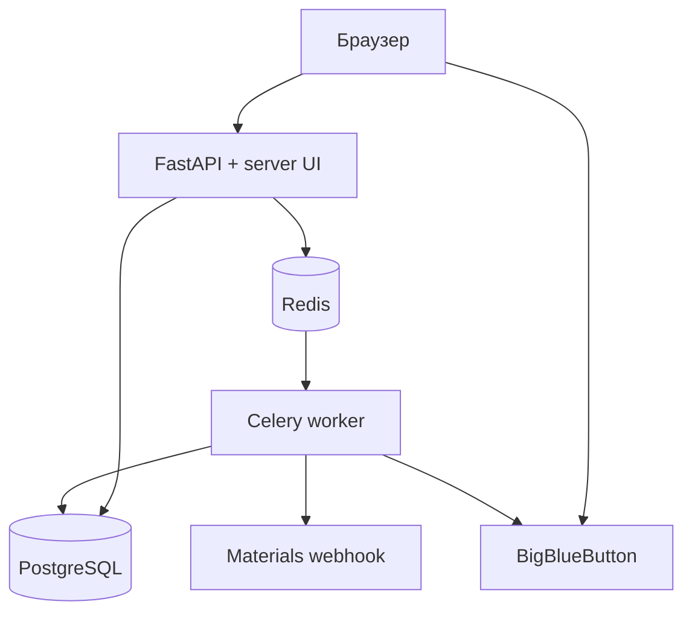

# Архитектура пилота

## Цель

Пилот проверяет единый ежедневный сценарий репетитора: карточка ученика → расписание →
BigBlueButton-комната → заметки → фоновая подготовка материалов.

## Контейнеры

BigBlueButton разворачивается отдельно: его официальный сервер имеет собственные требования к
Ubuntu, домену, TLS, UDP-портам и ресурсам. Приложение обращается к checksum API только с backend;
shared secret никогда не передаётся браузеру.

## Данные

- `Student` — профиль, контакты, цель и текущая ставка.
- `Lesson` — слот расписания, snapshot ставки и случайные реквизиты BBB.
- `RecordingAsset` — метаданные записи и playback URL.
- `ProcessingJob` — наблюдаемое фоновое задание.
- `MaterialArtifact` — проверяемый Markdown-результат.

## Границы доверия

- Сессия преподавателя защищена общим кодом пилота и подписанной cookie.
- Публичная ссылка ученика содержит HMAC для пары `lesson_id + student_id`.
- Роль и пароль BigBlueButton формирует backend.
- Формы преподавателя защищены CSRF-токеном.
- Материалы считаются черновиками до проверки преподавателем.

## Следующий архитектурный шаг

После проверки сценария общий код доступа заменяется пользователями и tenant-моделью. Схему БД
следует перевести на Alembic, а обработку записей запускать из BigBlueButton recording-ready webhook.

