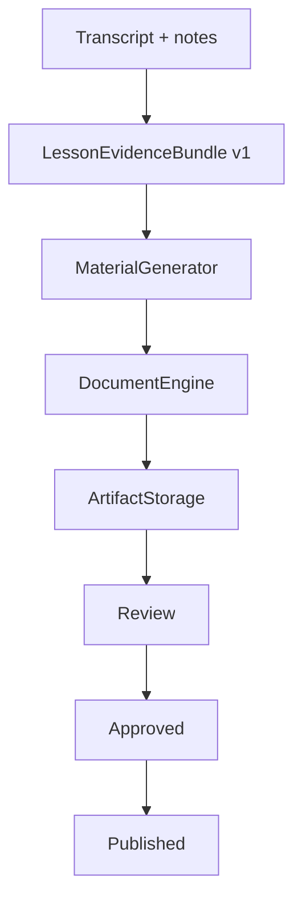

# Фабрика материалов 0.6

## Назначение

После транскрибации приложение фиксирует неизменяемый `LessonEvidenceBundle v1`, передаёт его
генератору материалов, собирает комплект TEX/HTML/PDF и оставляет результат преподавателю на
проверку. Генерация не означает автоматическую публикацию.

## Поток данных



`LessonEvidenceBundle v1` валидируется Pydantic-моделью. Публичная JSON Schema хранится в
`schemas/lesson-evidence-bundle-v1.schema.json`. Канонический JSON хешируется SHA-256; одинаковые
данные одного tenant не сохраняются повторно.

## Модель хранения

| Сущность | Назначение |
|---|---|
| `lesson_evidence_bundles` | снимок входных данных и его SHA-256 |
| `generation_runs` | одна попытка генерации для одного processing job |
| `artifact_versions` | TEX, HTML и PDF с версией, размером, MIME и SHA-256 |
| `build_logs` | этапы evidence/build/review/publish и ошибки |

Повторная доставка того же job использует `idempotency_key` и не создаёт второй комплект.
Осознанный повторный запуск кнопкой «Сформировать» создаёт новый job, новый `GenerationRun` и
следующий номер версии. Старые версии не перезаписываются.

## DocumentEngine

Контракт `DocumentEngine` не зависит от конкретного компилятора. Доступны два адаптера:

- `local` — детерминированный движок разработки: реальный TEX и HTML, минимальный PDF preview;
- `latex-for-everyone` — отправляет TEX в `POST /api/compile/raw`, затем скачивает PDF по
  возвращённому защищённому `pdf_url` с тем же Bearer-токеном.

Настройка production-компилятора:

```dotenv
DOCUMENT_ENGINE_PROVIDER=latex-for-everyone
DOCUMENT_ENGINE_URL=https://latex.example.com
DOCUMENT_ENGINE_TOKEN=access-token-from-latex-service
DOCUMENT_ENGINE_TIMEOUT=120
DOCUMENT_MAX_PDF_MB=50
```

Токен является серверным секретом и не попадает в HTML, журнал сборки или health endpoint.
Учётная запись `latex-for-everyone` должна быть технической и иметь отдельный жизненный цикл
токена. При его ротации достаточно перезапустить app и worker.
Ответ компилятора принимается только с PDF-сигнатурой и в пределах `DOCUMENT_MAX_PDF_MB`.
Production-конфигурация с модулем materials не запускается с локальным preview-движком.

## ArtifactStorage

Текущий адаптер `local` записывает бинарные файлы атомарно в `ARTIFACT_STORAGE_ROOT`. В Docker
app и worker используют общий volume `artifact-data`, иначе web-процесс не сможет отдать файл,
который создал worker. Ключ формируется только сервером:

```text
organization/lesson/generation-run/vN/material.{tex,html,pdf}
```

Пути с `..` и абсолютные пути отвергаются. В БД хранятся только ключ, MIME, размер и SHA-256.
Следующим адаптером может стать S3/MinIO без изменения application-сервиса.

## Проверка и публикация

Состояния комплекта: `building → review_required → approved → published`. Преподаватель скачивает
каждый формат, изучает журнал сборки и нажимает «Согласовать». Только согласованный комплект можно
опубликовать. Обе операции tenant-scoped, защищены пользовательской сессией и CSRF и записываются
в аудит.

Пока `published` означает зафиксированное бизнес-состояние. Доставка в кабинет ученика/родителя
будет отдельным подписчиком на событие публикации в следующем этапе.

## Эксплуатация

```bash
uv run alembic upgrade head
make schema-check
make check
```

Миграция `0005_materials_factory` добавляет новые таблицы и не изменяет старые Markdown-артефакты.
Это позволяет откатить приложение без потери ранее созданных материалов. Перед production upgrade
обязателен backup БД и каталога/volume артефактов.
