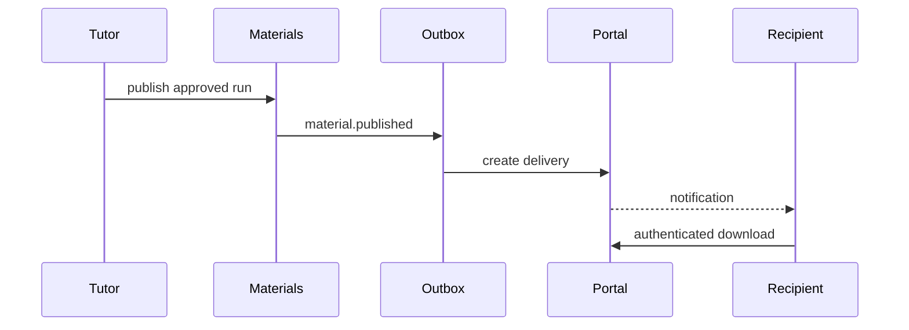

# Кабинеты и доставка материалов 0.7

## Назначение

После согласования преподаватель публикует комплект материалов. Публикация, audit-запись и
`material.published` сохраняются одной транзакцией. Обработчик transactional outbox создаёт
идемпотентную доставку и внутренние уведомления. Ученик или родитель получает доступ только через
явную связь с карточкой ученика.



## Модель доступа

`StudentAccess` связывает `user_id` и `student_id` внутри одной организации. Допустимые роли —
`student` и `parent`. Один родитель может быть связан с несколькими детьми. Отзыв переводит связь
в неактивное состояние и сохраняет историю.

Приглашение получателя создаётся из карточки ученика. Оно содержит `student_id`, роль, SHA-256
токена и срок действия. При принятии одной транзакцией создаются или активируются `Membership` и
`StudentAccess`. Приглашение для ученика другой организации отклоняется.

## Публикация и доставка

Состояния комплекта:

```text
review_required → approved → published → revoked
```

`PublicationService` является единственным HTTP-путём публикации. Он атомарно обновляет комплект,
создаёт `OutboxEvent` и `AuditEvent`. `PortalEventHandler` обрабатывает события:

- `material.published` — создаёт `MaterialDelivery(available)` и уведомления;
- `material.revoked` — переводит доставку в `revoked` и уведомляет получателей.

Dedup key события включает generation run и версию. Уникальность доставки и уведомлений защищает
от повторной обработки сообщения.

## Авторизация файлов

Получатель может открыть артефакт только если одновременно выполняются условия:

1. membership пользователя активен;
2. активен `StudentAccess` к ученику доставки;
3. доставка имеет статус `available`;
4. generation run и artifact имеют статус `published`;
5. все сущности относятся к организации из подписанной сессии.

Несоответствие возвращает `404`, чтобы не раскрывать существование чужого UUID. PDF и TEX
отдаются как attachment с `private, no-store`. HTML показывается в iframe с `sandbox` и строгим
Content Security Policy.

## Миграция

`0006_portal_delivery` добавляет:

- `invitations.student_id`;
- `student_access`;
- `material_deliveries`;
- `user_notifications`.

Ревизия `0007_production_postgres` усиливает эти таблицы составными tenant foreign keys и
индексами запросов кабинета. Подробности находятся в [production-database.md](production-database.md).

Миграция обратима и не удаляет generation runs или артефакты. Перед production-обновлением нужны
backup БД и хранилища файлов.

## Проверка

```bash
uv run alembic upgrade head
uv run pytest tests/test_portal.py
make check
```
